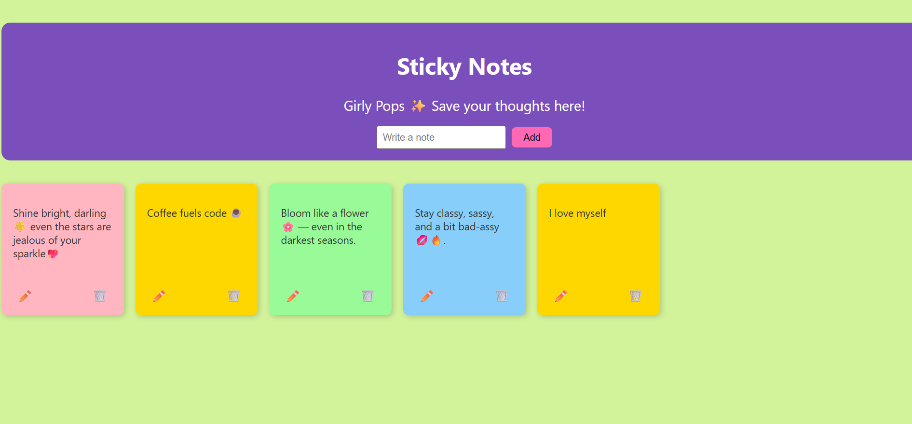

# Sticky Notes App 📝✨

A fun, girly-styled sticky notes app where you can add, edit, and delete your thoughts.  
Your notes are saved in **localStorage**, so they stay even if you close the browser!  

## Features
- Add colorful sticky notes 🎨 
- Edit and delete notes ✏️🗑️  
- Auto-save using localStorage 💾  
- Deployed easily with Vercel 🚀  

## Screenshot
Here’s how it looks:  



## How to Run Locally
1. Clone the repo  
   ```bash
   git clone https://github.com/doracodes03/sticky-notes-app.git
